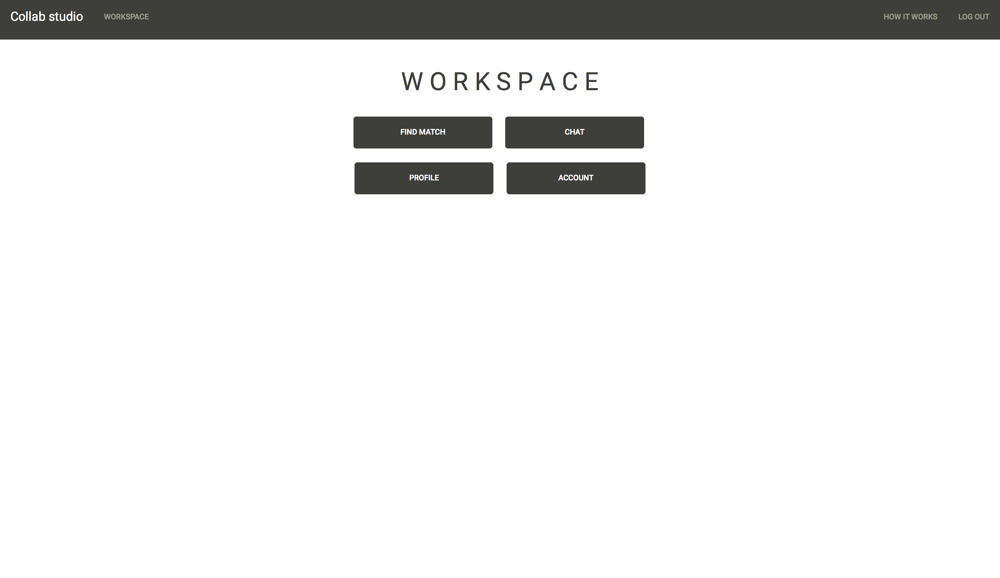
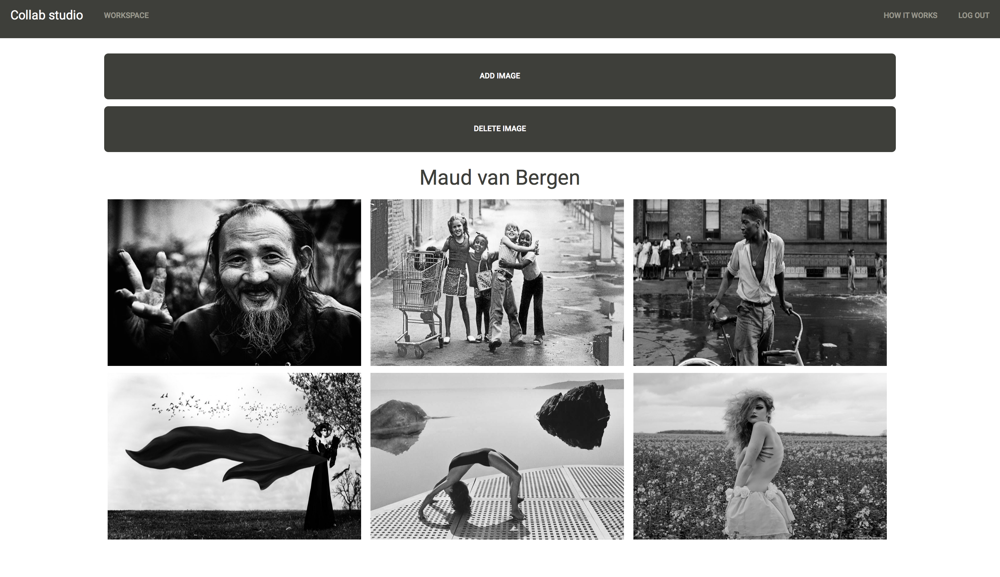
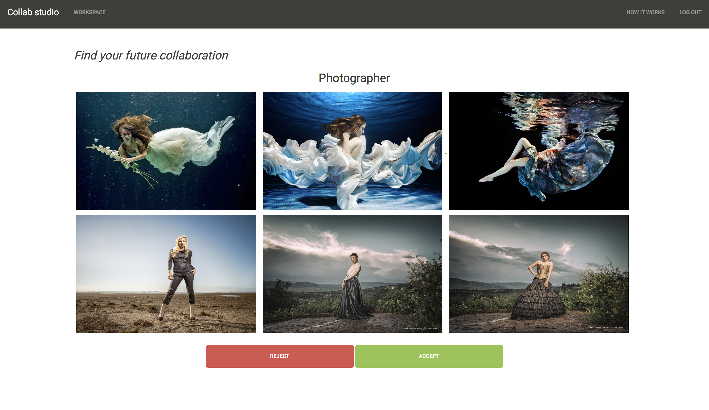
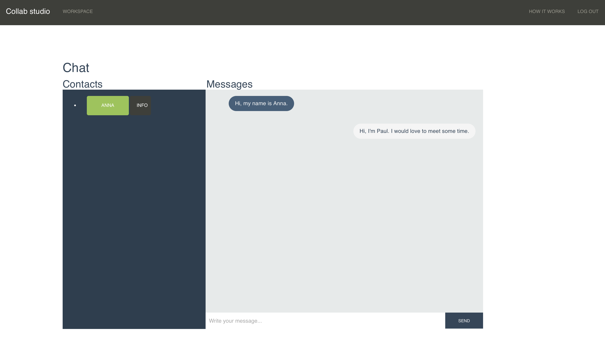

# Collab Studio
### Maud van Bergen, Jenny Heddes en Jasper de Lange

## features:

* **Registreren**
Gebruikers kunnen een account aanmaken voor de website. Hierbij moeten ze aangeven wat hun naam en e-mailadres zijn, wat voor werk ze doen en naar wat voor partners ze op zoek zijn. Om er zeker van te zijn dat het ingevulde e-mailadres te bereiken is, wordt er een email gestuurd naar het opgegeven e-mailadres. Mocht dit niet lukken, dan moet de gebruiker opnieuw een e-mailadres invullen.

* **Inloggen**
* **Uitloggen**

* **Match vinden**
Bij het aanmaken van een profiel, kunnen mensen opgeven wat voor werk ze doen en één of twee soorten partners vinden waarmee ze in contact willen worden gebracht. Door te kijken naar wat iedereen hierbij heeft aangegeven, worden mogelijke "matches" uit de database gepakt. In de matchfunctie krijgen gebruikers zes foto's uit het profiel van een mogelijke match te zien. Hierna kunnen ze aangeven of ze wel of niet met diegene samen willen werken door op de accept- of reject-knop te drukken.

* **Profiel weergeven en aanpassen**
Geeft het profiel van de gebruiker weer en laat de gebruiker foto's toevoegen aan het profiel en foto's van het profiel verwijderen.

* **Persoonsgegevens wijzigen**
De gebruiker kan de persoonlijke gegevens die zijn ingevuld bij het registreren aanpassen. Als er een nieuw e-mailadres wordt opgegeven, wordt op dezelfde methode gecheckt of het een geldig e-mailadres is, als bij het registreren.

* **Nieuw wachtwoord aanvragen**
Mocht de gebruiker zijn/haar wachtwoord zijn vergeten. Dan kan deze worden opgevraagd door de gebruikersnaam en het corresponderende e-mailadres in te vullen. Vervolgens wordt er een nieuw wachtwoord naar dat e-mailadres gestuurd. Na met dit wachtwoord te zijn ingelogd, kan de gebruiker zelf het wachtwoord weer veranderen.

## Taakverdeling:

### Maud:
register, login, logout, upload, delete, extra search en stylecheck.

### Jenny:
HTML's, profileroute, homepage, howitworks, findroute, logo en chat.

### Jasper:
databases aanmaken, accoutroutes, mailfuncties.

## Extra uitleg voor navigatie:

In de map zitten verscheidende mapjes en bestanden. hieronder wordt per map/bestand uitgelegd waar het voor is en wat er allemaal instaat.

### Folder email_templates
In deze folder staan .txt bestanden die dienen als templates voor de e-mails die naar de gebruikers worden verstuurd. In deze .txt bestanden staan zogenaamde "placeholders" ({}), die bij de emailfuncties worden ingevuld met persoonlijke gegevens om de mail te personaliseren.

### Folder static
In deze folder zit een folder genaamd img. In img zitten worden de afbeeldingen opgeslagen die door de gebruikers zijn geüpload of die door de site zelf worden gebruikt. Zoals logo en dergelijke.

### Folder templates
In deze folder staan de .html bestanden voor elke webpagina die de site gebruikt.

### Bestand application.py
In dit python bestand staan de approutes die worden gebruikt bij de applicatie. elke route bevat verdere uitleg door middel van comments.

### Bestand helpers.py
In dit bestand staan de functies die vaak worden gebruikt in application.py. De apology functie geeft aan wat er misgaat als er de applicatie op een probleem stuit. De login_required functie dient ervoor om bepaalde webpagina's af te schermen van gebruikers die niet zijn ingelogd.

### Bestand model.py
In dit bestand staan de functies die gebruikmaken van de databases. deze functies kunnen bijvoorbeeld informatie in een database stoppen, informatie uit een database halen of informatie in een database veranderen. elke funtie bevat een verdere beschrijving in de vorm van comments

#### Bestand WEBIK.db
Dit .db bestand bevat alle databases die in de applicatie worden gebruikt. Matchstatus houdt de matchstatussen bij, messages bevat alle berichten die worden verzonden bij de chatfunctie inclusief afzender, ontvanger en timestamp. pairs houdt alle matches bij, pictures bevat de links naar alle foto's in de img folder in de static folder. Users bevat alle persoonlijke informatie van de gebruikers als id, gebruikersnaam, gehasht wachtwoord, email, naam, work, search en (als het is ingevuld) extra_search.
